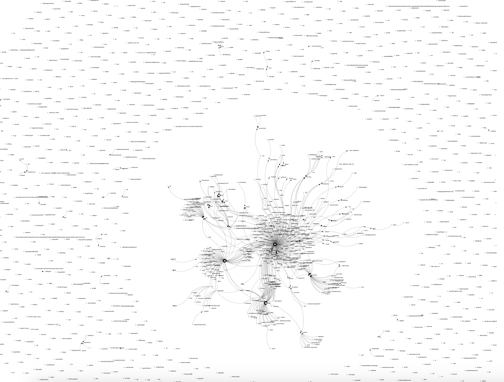

# Metamodel Dependencies Analyzer 
<h4>This repository contains the code developed for the dependencies analysis of metamodels</h4>

The developed script is able to analyse a repository of Ecore models, given as input folder, and generate a graph-based representation of the metamodels

 In this representation the edges are the dependencies among the Ecore models, e.g., a reference type defined in another Ecore Models. 

This tool has been used in Edelta to support the parallel evolution of metamodels.

We report here the image of the dependencies-graph generated from the dataset published at [1]

[1] Barriga, Angela, et al. "An extensible tool-chain for analyzing datasets of metamodels." Proceedings of the 23rd ACM/IEEE International Conference on Model Driven Engineering Languages and Systems: Companion Proceedings. 2020.

